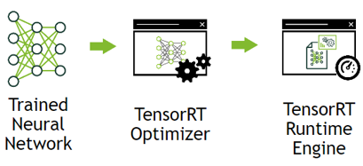

# YOLOv3-Torch2TRT

## Introduction
Convert YOLOv3 and YOLOv3-tiny (PyTorch version) into TensorRT models, through the torch2trt Python API.

TensorRT 모델 변환 작업 

- 학습 모델 Torch -> ONNX -> TensorRT 변환 후 성능 측정 
- NVIDIA GPU에서 추론속도 향항
- Torch 프레임워크로 학습된 모델을 그대로 변경 가능 
- 변경된 모델은 TensorRT 뚜햐ㅜㅎ tkddptj ehdwkr 
- TensorRT 변환을 위한 환경 구축 관련 링크 : https://github.com/NVIDIA-AI-IOT/torch2trt

## Installation 
#### Clone the repo
    git clone https://github.com/worl2997/YOLOv3-Torch2TRT.git
    
#### Download pretrained weights
    $ cd weights/
    $ bash download_weights.sh
 
## Requirements
Two special Python packages are needed:
  
* tensorrt
  
* torch2trt
  
 Due to the upsampling operation in YOLO, according to torch2trt API introduction, you need to install the version with plugins.
 
 Installation reference: https://github.com/NVIDIA-AI-IOT/torch2trt
 
#### Check torch2trt API

    python3 check.py
 
 
## Inference Acceleration
Acceleration Techs：
* FP16
* TensorRT

Entire Model* = Backbone + Feature Net + YOLO Head

    python3 detect.py

## Statement
This repo is based on [PyTorch-YOLOv3](https://github.com/eriklindernoren/PyTorch-YOLOv3).

